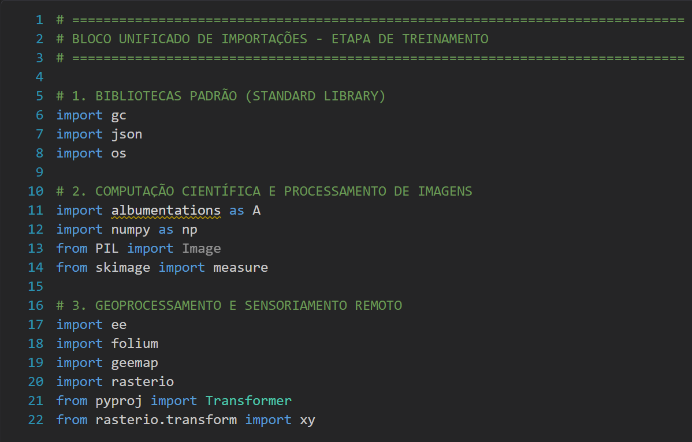
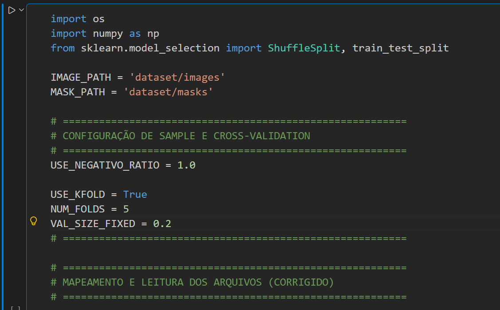
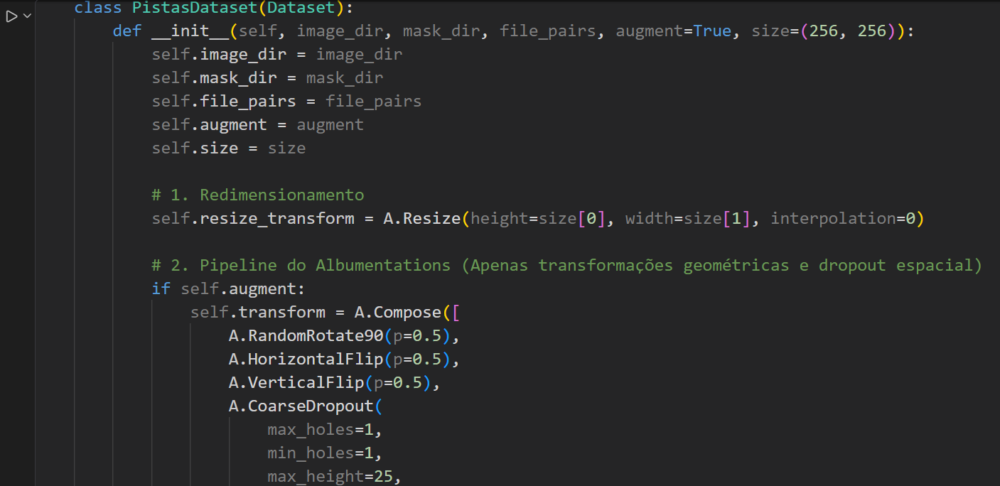
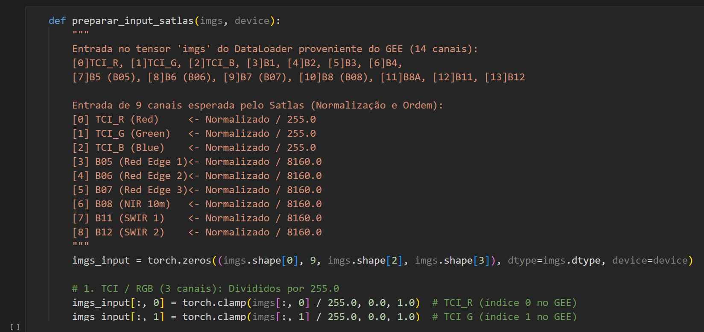
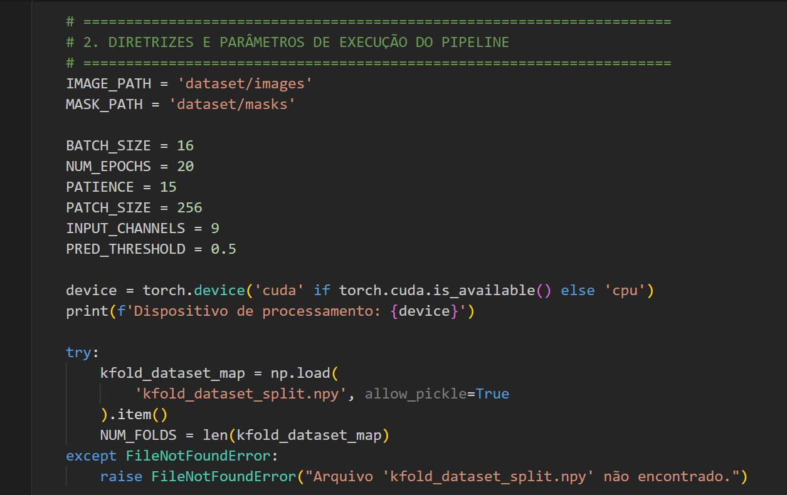
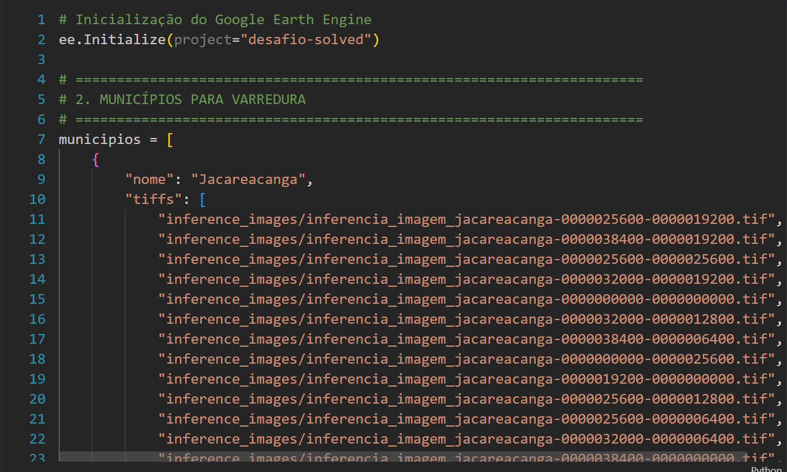
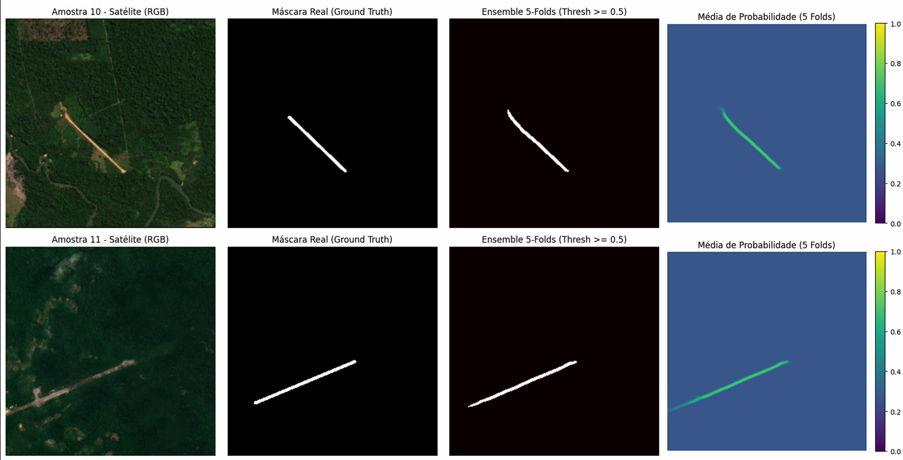
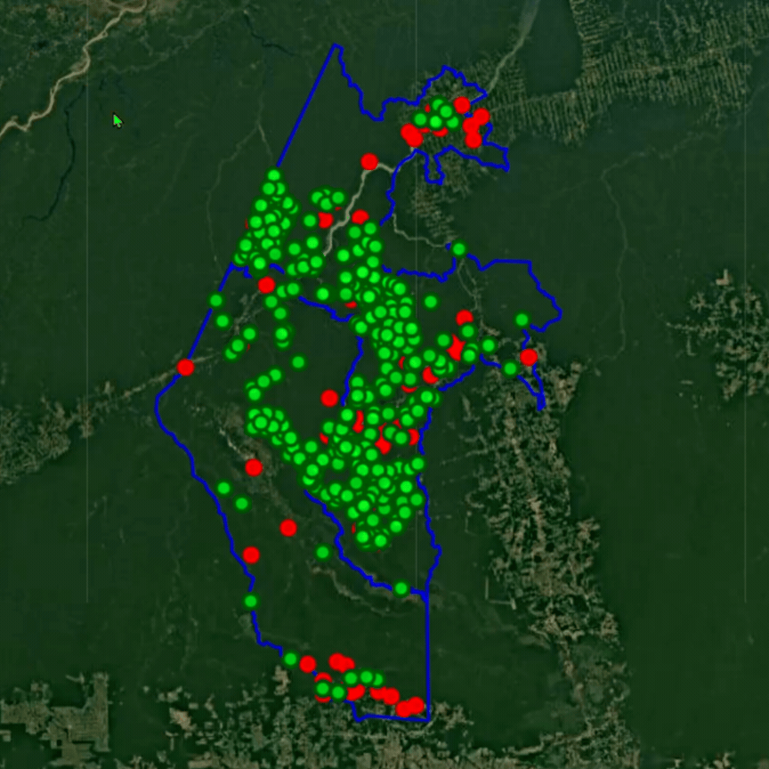
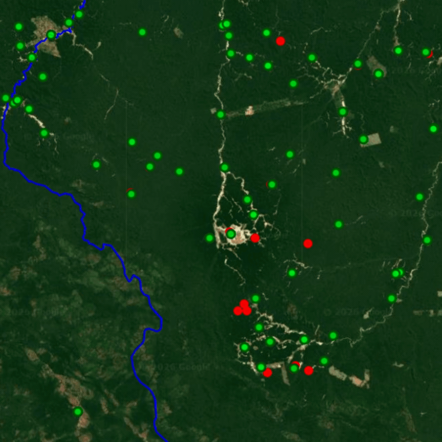

## Sumário

1. [Sobre o Projeto & Documentação](#1-sobre-o-projeto--documentação)
   - [1.1. Abordagem e Visão Geral](#11-abordagem-e-visão-geral)
   - [1.2. Metodologia de Classificação](#12-metodologia-de-classificação)
2. [Estrutura do Código-Fonte](#2-estrutura-do-código-fonte)
3. [Instruções de Execução](#3-instruções-de-execução)
   - [3.1. Clonar o Repositório](#31-clonar-o-repositório)
   - [3.2. Criar e Ativar o Ambiente Virtual](#32-criar-e-ativar-o-ambiente-virtual)
   - [3.3. Instalar as Dependências](#33-instalar-as-dependências)
   - [3.4. Baixar e Organizar os Datasets](#34-baixar-e-organizar-os-datasets)
   - [3.5. Passos para Execução no Jupyter Notebook](#35-passos-para-execução-no-jupyter-notebook)
4. [Resultados Obtidos](#4-resultados-obtidos)
   - [4.1. Resultado do treinamento em imagens da validação](#41-resultado-do-treinamento-em-imagens-da-validação)
   - [4.2. Comparação Visual: Modelo vs. Baseline (GIF)](#42-comparação-visual-modelo-vs-baseline-gif)
   - [4.3. Visualização Interativa (Mapa HTML)](#43-visualização-interativa-mapa-html)
   - [4.4. Exportação e Integração no Google Earth Engine (GEE)](#44-exportação-e-integração-no-google-earth-engine-gee)
5. [Desafios e Soluções](#5-desafios-e-soluções)

6. [Lições Aprendidas e Agradecimentos](#6-lições-aprendidas-e-agradecimentos)
   - [6.1. Lições Aprendidas](#61-lições-aprendidas)
   - [6.2. Agradecimentos](#62-agradecimentos)

---

## 1. Sobre o Projeto & Documentação

### 1.1. Abordagem e Visão Geral

A identificação manual de pistas de pouso não homologadas em áreas extensas da Amazônia Legal é um desafio logístico lento e de alto custo. Este projeto implementa um pipeline automatizado de **Segmentação Semântica por Deep Learning** para mapeamento e detecção contínua dessas superfícies a partir de imagens de satélite multiespectrais do Google Earth Engine (GEE).

O objetivo principal é fornecer um fluxo robusto e escalável capaz de realizar varreduras em municípios críticos (como **Jacareacanga** e **Itaituba**), extraindo feições geográficas precisas e gerando camadas vetoriais de saída (`GeoJSON` e mapas interativos em `Folium` / `GEE`) para validação contra bases de referência, como o MapBiomas.

**Fluxo Geral da Solução:**
* **Ingestão:** Carregamento de rasters multiespectrais (`.tif`) extraídos do Earth Engine.
* **Processamento:** Reordenação e normalização de canais via padrão Satlas, com *data augmentation* dinâmico.
* **Modelagem:** Treinamento supervisionado com validação cruzada em 5 Folds.
* **Vetorização e Entrega:** Limiarização de probabilidades, extração vetorial e publicação de mapas comparativos interativos.

---

### 1.2. Metodologia de Classificação

#### Curadoria do Dataset e Garantia Ética de Isolamento

* **Rotulagem e Ground Truth:** Para garantir a confiabilidade das amostras positivas e eliminar falsos positivos do MapBiomas, foi feito o cruzamento espacial entre dados do **OpenStreetMap (OSM)** e do **MapBiomas**. Amostras negativas (áreas de fundo sem pistas) foram adicionadas com máscaras nulas (*all-black*).
* **Isolamento Geográfico sem *Data Leakage*:** Nenhuma imagem dos municípios de **Jacareacanga** e **Itaituba** foi utilizada no treinamento ou validação. Esses municípios foram reservados exclusivamente para a fase de inferência (*out-of-distribution*), garantindo rigor ético e validando a capacidade real de generalização do modelo em territórios nunca vistos.

#### Ingestão de Dados e Pré-Processamento

* **Mapeamento de Canais Satlas:** As imagens `.tif` multiespectrais originais (14 canais do Google Earth Engine) foram reordenadas e filtradas para os **9 canais** compatíveis com o padrão de entrada das redes Satlas através da função `preparar_input_satlas`. As 14 bandas foram escolhidas para caso o modelo Satlas não obtivesse sucesso na tarefa, desse modo eu procuraria outro modelo pré-treinado e não precisaria baixar todas as imagens de novo gastand cotas do GEE.
* **Pipeline PyTorch (`PistasDataset`):** Leitura customizada dos rasters, tratamento dinâmico de valores ausentes (`NaNs`) e aplicação de transformações de *data augmentation* para expandir a variabilidade espectral e espacial.

#### Modelagem e Fine-Tuning

* **Arquitetura Base:** Processo de *fine-tuning* utilizando o modelo pré-treinado **`Sentinel2_SwinB_SI_MS`** do repositório oficial da Allen Institute for AI ([satlaspretrain_models](https://github.com/allenai/satlaspretrain_models)), alavancando a *backbone* Swin Transformer para sensoriamento remoto multiespectral, no decoder foi utilizado uma **U-net** e **Cross Entropy loss**, também disponíveis no repositório ([satlaspretrain_models](https://github.com/allenai/satlaspretrain_models)).
* **Validação Cruzada (5-Fold CV):** Divisão em **5 Folds** (`kfold_dataset_split.npy`) para maximizar a estabilidade dos pesos e evitar viés de amostragem.

#### Pós-Processamento e Inferência

* **Calibração de Limiares:** Na fase de inferência em Jacareacanga e Itaituba, foram aplicados o **limiar de probabilidade (*threshold*) ótimo** calibrado no treinamento e o **filtro de corte de área máxima predita** definido durante a validação.
* **Vetorização:** Conversão das máscaras binarizadas em primitivas geográficas (pontos e polígonos), exportadas para o formato padronizado `GeoJSON`.

---

## 2. Estrutura do Código-Fonte

Organização dos diretórios e arquivos do repositório:

```text
initial-challenge-semantic-segmentation/
├── dataset/
│   ├── images/           <-- Imagens de treinamento (.tif)
│   └── masks/            <-- Máscaras de treinamento (.tif)
├── inference_images/     <-- Imagens de entrada para inferência
├── docs/                 <-- Documentação e imagens do README
│   └── output/           <-- GIFs e amostras visuais de saída
├── main.ipynb            <-- Notebook com pipeline de Treinamento e Inferência
├── dataset_loader.ipynb  <-- Notebook contendo o pipeline de download do dataset(Não deve ser executado, pois as imagens de treino estão disponíveis no drive)

├── requirements.txt      <-- Dependências do projeto
└── README.md             <-- Documentação principal

```

---

## 3. Instruções de Execução

Siga os passos abaixo para preparar o ambiente virtual, baixar as dependências e organizar os datasets necessários para a execução dos scripts de treino e inferência.

### 3.1. Clonar o Repositório

No terminal da sua máquina, clone o repositório e navegue até a pasta do projeto:

```bash
git clone [https://github.com/SEU_USUARIO/SEU_REPOSITORIO.git](https://github.com/SEU_USUARIO/SEU_REPOSITORIO.git)
cd SEU_REPOSITORIO

```

---

### 3.2. Criar e Ativar o Ambiente Virtual

* **No Linux / macOS:**

```bash
python3 -m venv venv
source venv/bin/activate

```

* **No Windows (PowerShell):**

```powershell
python -m venv venv
.\venv\Scripts\activate

```

---

### 3.3. Instalar as Dependências

Com o ambiente virtual ativado, atualize o gerenciador de pacotes e instale todas as bibliotecas necessárias:

```bash
pip install --upgrade pip
pip install -r requirements.txt

```

---

### 3.4. Baixar e Organizar os Datasets

Devido ao tamanho das imagens (> 1 GB), os dados não estão armazenados diretamente no repositório. Você precisa baixá-los do Google Drive e extraí-los nas pastas correspondentes.

1. **Baixar os arquivos compactados:**
* **Imagens de Treino (`.zip`):** [Clique aqui para baixar do Google Drive](https://drive.google.com/drive/folders/1zN6KxEPcuiDp3y_cc9QNCqsAyLMQbCgT?usp=sharing)
* **Máscaras de Treino (`.zip`):** [Clique aqui para baixar do Google Drive](https://drive.google.com/drive/folders/1Kd3tvq0iL1oNJBiicZANL2x6xfHr4NGs?usp=sharing)
* **Imagens de Inferência (`.zip`):** [Clique aqui para baixar do Google Drive](https://drive.google.com/drive/folders/1ksY876SZgbhnhxr8bPrr6u9246xLsnGm?usp=sharing)

```text
initial-challenge-semantic-segmentation/
├── dataset/
│   ├── images/           <-- Coloque as imagens de treino aqui
│   └── masks/            <-- Coloque as máscaras de treino aqui
├── inference_images/     <-- Coloque as imagens de inferência aqui


```


2. **Garanta a estrutura de diretórios:**
Após extrair, certifique-se de que as imagens `.tif` foram colocadas dentro de `dataset/images/`, `dataset/masks/` e `inference_images/`.

---

### 3.5. Passos para Execução no Jupyter Notebook

Siga a sequência das células para carregar as dependências, instanciar as classes de dados, preparar a normalização do modelo e rodar a inferência.

---

#### 1. Importação das Bibliotecas
Execute o primeiro bloco de código do notebook para carregar todos os módulos essenciais (PyTorch, Rasterio, Earth Engine API, Folium, OpenCV, etc.):



---

#### 2. Organização do Dataset e Mapeamento
Execute o segundo bloco para realizar a divisão das amostras positivas e negativas entre imagens e máscaras, gerando o arquivo de mapeamento `kfold_dataset_split.npy`:



---

#### 3. Instanciação da Classe `PistasDataset`
Execute a célula contendo a classe `PistasDataset`, responsável pela leitura dos arquivos TIFF multiespectrais, tratamento de valores nulos (NaNs) e aplicação das transformações de *data augmentation*:



---

#### 4. Ordenação e Normalização das Bandas (Satlas)
Execute a célula que define a função `preparar_input_satlas`. Ela reordena os 14 canais originais provenientes do Google Earth Engine (GEE) para os 9 canais requeridos e aplica a normalização adequada do padrão Satlas:



---

#### 5. Execução do Treinamento
Execute o bloco de treinamento para salvar os pesos dos 5 folds:



#### 5. Execução da Inferência
Execute o bloco de inferência para gerar o arquivo html do folium e o arquivo geojson.



### 6. Download Opcional dos Pesos Pré-treinados

Caso não deseje treinar o modelo localmente em sua máquina, você pode fazer o download dos pesos pré-treinados no botão abaixo:

* **[Baixar Pesos Pré-treinados (Google Drive)](https://drive.google.com/drive/folders/1ohtgkjEtNIDENoobPmr_7zTAXWVYnHcK?usp=sharing)**

```text
initial-challenge-semantic-segmentation/
├──      <--- Coloque os arquivos .pth na raiz principal do projeto

```

---

## 4. Resultados Obtidos

Esta seção apresenta a validação das predições geradas pelo modelo em comparação com o baseline da MapBiomas.

### 4.1. Resultado do treinamento em imagens da validação

Abaixo, a demonstração dos resultados das imagens de validação após o treinamento dos folds:



### 4.2. Comparação Visual: Modelo vs. Baseline (GIF)

Abaixo, a demonstração da camada interativa alternando entre as detecções do projeto e as referências de mercado para os municípios de **Jacareacanga** e **Itaituba**:



* 🔴 **Pontos em Vermelho:** Detecções e predições geradas do modelo.
* 🟢 **Pontos em Verde:** Marcações de referência do modelo da MapBiomas.

#### Detalhamento de Proximidade (Zoom):

Em maior detalhamento espacial, é possível notar a elevada concordância entre as predições do modelo e o mapeamento do MapBiomas:



* 🔴 **Pontos em Vermelho:** Detecções do modelo.
* 🟢 **Pontos em Verde:** Marcações do MapBiomas.

---

### 4.3. Visualização Interativa (Mapa HTML)

O mapa completo com seletores de camada e alternância de visualização está disponível em formato HTML interativo:

* **[Clique aqui para abrir o Mapa Interativo no Navegador](https://danielnaiff.github.io/initial-challenge-semantic-segmentation/)**


> **Recursos do Mapa:**
> * Seletores laterais para ativar/desativar as camadas vermelha (modelo) e verde (referência).
> * Ferramentas de zoom e inspeção dos atributos dos pontos detectados.
> 
> 

---

### 4.4. Exportação e Integração no Google Earth Engine (GEE)

#### Arquivo Vetorial GeoJSON

As saídas vetoriais brutas com os pontos e polígonos preditos estão salvas no formato GeoJSON na pasta de saídas:

* **Arquivo:** [`outputs/predicoes_geograficas.geojson`](https://www.google.com/search?q=outputs/predicoes_geograficas.geojson)

#### Visualização Interativa no Google Earth Engine (GEE)

Além do arquivo local, os resultados vetoriais foram disponibilizados na plataforma do Earth Engine para inspeção remota com as coleções de imagens de satélite:

* **[Acessar o Mapa Interativo no GEE](https://desafio-solved.projects.earthengine.app/view/desafio-solved-pistasdepouso)** *(Link direto para o Earth Engine App com as camadas pré-carregadas)*

---

## 5. Desafios e Soluções

A construção deste pipeline envolveu um processo iterativo de superação de obstáculos técnicos, desde a engenharia de dados até a calibração da inferência:

### 1. Insuficiência de Dados e Falsos Positivos em Bases Públicas
* **Desafio:** Modelos iniciais treinados do zero com poucas amostras manuais falharam em generalizar. A base do MapBiomas resolvia o volume, mas continha poucos ruídos e falsos positivos gerados por IA, o que contaminaria o modelo.
* **Solução:** Implementação de um pipeline de validação cruzando dados do **MapBiomas** com a API do **OpenStreetMap (OSM)** para selecionar apenas pistas confirmadas. Para superar os gargalos e oscilações da API gratuita do OSM, desenvolveu-se um sistema de **cache local**, garantindo a persistência dos dados e resiliência no download.

### 2. Isolação Ética do Conjunto de Inferência (*Zero Data Leakage*)
* **Desafio:** Avaliar a capacidade real de generalização do modelo em um cenário *out-of-distribution* sem contaminação do dataset.
* **Solução:** Rigor moral e técnico ao **excluir completamente os municípios de Jacareacanga e Itaituba** do conjunto de treinamento e validação. O modelo realizou a inferência final sem nunca ter visto o território desses municípios durante o treino.

### 3. Falsos Positivos em Clareiras, Rodovias e Desmatamentos
* **Desafio:** Após expandir o dataset, o modelo passou a classificar clareiras na floresta, trechos de rodovias e estradas de terra como pistas de pouso.
* **Solução (Hard Negative Mining Automático):** Identificou-se que o município de *Brasil Novo* não possuía pistas registradas. Realizou-se uma inferência no local para extrair automaticamente as regiões de falso positivo e incorporá-las ao treino como amostras negativas (máscaras *all-black*). Além disso, foram mapeados manualmente mais de **600 pontos de falsos positivos** no GEE.

### 4. Limitações de Treinamento *From Scratch* e Especificidade de Satélite
* **Desafio:** O treinamento de redes UNet do zero com pesos aleatórios gerava um modelo extremamente conservador (baixa revocação) ou ruidoso. Pesos pré-treinados do ImageNet não se adequavam a imagens multiespectrais de satélite.
* **Solução:** Transição para a técnica de **Fine-Tuning** utilizando o modelo pré-treinado **`Sentinel2_SwinB_SI_MS`** da suíte [SatlasPretrain Models](https://github.com/allenai/satlaspretrain_models) (Allen Institute for AI), baseado na arquitetura Swin Transformer especializada em imagens multiespectrais do Sentinel-2.

### 5. Compatibilidade de Canais Radiométricos (14 vs. 9 Bandas)
* **Desafio:** As imagens brutas extraídas do Google Earth Engine continham 14 bandas, enquanto o modelo Satlas exigia exatamente 9 bandas organizadas em uma ordem específica.
* **Solução:** O download de 14 bandas foi mantido estrategicamente como margem de segurança arquitetural para testes futuros. Na ingestão do modelo, a função customizada `preparar_input_satlas` foi encarregada de reordenar, selecionar e normalizar dinamicamente os 9 canais necessários.

### 6. Calibração e Pós-Processamento Geométrico
* **Desafio:** Eliminar ruídos remanescentes nas máscaras de inferência sem comprometer a detecção de pistas reais.
* **Solução:** Extração dos parâmetros ótimos obtidos durante a validação cruzada (**5-Fold CV**), estabelecendo limiares máximos de confiança no *softmax* e corte por área mínima predita. Na inferência, foram aplicados filtros morfológicos baseados na **excentricidade** e **razoes de aspecto** (*aspect ratio*) características de superfícies lineares de pouso.

---

## 6. Lições Aprendidas e Agradecimentos

### 6.1. Lições Aprendidas

* **Qualidade de Dados > Complexidade do Modelo:** Um dataset amplo, validado e enriquecido com amostras negativas difíceis (*hard negatives*) teve um impacto muito superior no desempenho do que a simples troca de funções de perda.
* **Fine-Tuning de Domínio Específico:** Alavancar modelos pré-treinados em sensoriamento remoto (Satlas/Swin Transformer) foi o divisor de águas para atingir convergência rápida e alta capacidade de generalização em pequenas estruturas geográficas.
* **Engenharia de Pós-Processamento:** Métricas geométricas e morfológicas (excentricidade, aspect ratio e área mínima) foram importantes para a predição do modelo neural.
* **Cooperação Científica e Open Source:** A ciência avançada e projetos desta escala só se tornam viáveis graças à colaboração aberta da comunidade. O acesso livre a dados, ferramentas públicas e arquiteturas pré-treinadas é o verdadeiro catalisador da inovação tecnológica.


### 6.2. Agradecimentos
Grande parte deste resultado foi alcançada graças às iniciativas de dados abertos e pesquisa científica comunitária:
* **[MapBiomas](https://brasil.mapbiomas.org/):** Pela disponibilização do mapeamento de referência geográfica de infraestruturas no território nacional.
* **[OpenStreetMap (OSM)](https://www.openstreetmap.org/#map=14/-3.46408/-49.36110):** Pela infraestrutura aberta e colaborativa de dados geográficos globais.
* **[Allen Institute for AI (AI2)](https://github.com/allenai/satlaspretrain_models):** Pelo desenvolvimento e liberação open-source do repositório [SatlasPretrain Models](https://github.com/allenai/satlaspretrain_models), viabilizando o uso de modelos pré-treinados avançados em sensoriamento remoto multiespectral.
